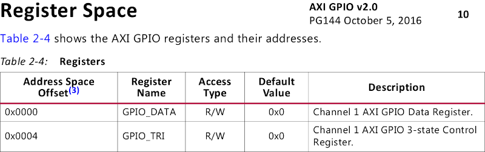
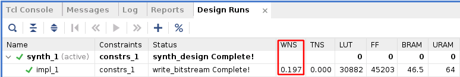
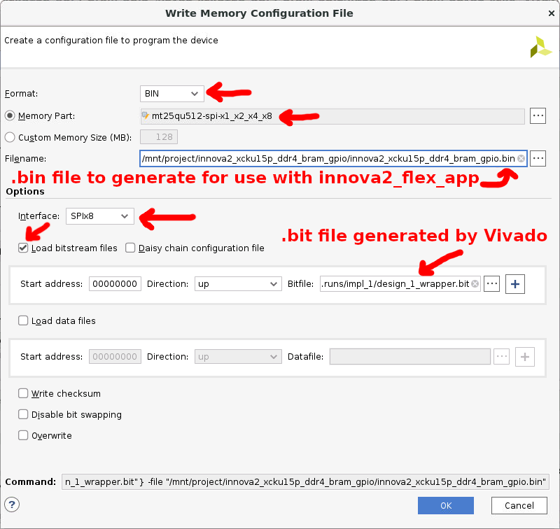

# Innova-2 XCKU15P XDMA PCIe Demo

This is a simple [Vivado 2023.1](https://www.xilinx.com/support/download/index.html/content/xilinx/en/downloadNav/vivado-design-tools/2023-1.html) starter project for the [XCKU15P FPGA](https://www.xilinx.com/products/silicon-devices/fpga/kintex-ultrascale-plus.html) on the [Innova-2 Flex SmartNIC](https://www.nvidia.com/en-us/networking/ethernet/innova-2-flex/) that implements a PCIe [XDMA](https://docs.xilinx.com/r/en-US/pg195-pcie-dma/Introduction) interface to BRAM and GPIO. LED D19 is connected to a divided down PCIe clock and blinks about once every second if XDMA is working.

This project was designed and tested on the [Innova2 **8GB** MNV303212A-AD**L**T](https://www.mellanox.com/files/doc-2020/pb-innova-2-flex.pdf) board but should be compatible with the [Innova2 **4GB** MNV303212A-AD**A**T/MNV303212A-AD**I**T](https://network.nvidia.com/pdf/eol/LCR-000437.pdf) and [MNV303611A-EDLT](https://www.mellanox.com/files/doc-2020/pb-innova-2-flex.pdf) as it only uses resources common to all the boards.

Refer to [this tutorial](https://github.com/mwrnd/notes/tree/main/Vivado_XDMA_DDR4_Tutorial) for detailed instructions on generating a similar project from scratch.


## Block Design


## Program the Design into the XCKU15P Configuration Memory

Refer to the [innova2_flex_xcku15p_notes](https://github.com/mwrnd/innova2_flex_xcku15p_notes/) project's instructions on [Loading a User Image using `innova2_flex_app`](https://github.com/mwrnd/innova2_flex_xcku15p_notes/#loading-a-user-image) which includes instructions on setting up an Innova-2 system including [Xilinx's PCIe XDMA Drivers (dma_ip_drivers)](https://github.com/Xilinx/dma_ip_drivers).

```
git clone --depth=1 https://github.com/mwrnd/innova2_xdma_demo.git
cd innova2_xdma_demo
md5sum *bin
echo 17f1703276cc6ab8bc88f840a036c17c should be md5sum of innova2_xdma_demo_primary.bin
echo 9e8cfb371b67cd1a34a5bf0ba1e49e1d should be md5sum of innova2_xdma_demo_secondary.bin
```


## Testing the Design

### lspci

After programming the bitstream and rebooting, the design should show up as `Memory controller: Xilinx Corporation Device 9038`. It shows up at PCIe Bus Address `03:00` for me.
```
lspci -d 10ee:
```


The following [lspci](https://manpages.ubuntu.com/manpages/jammy/man8/lspci.8.html) commands list all Mellanox and Xilinx devices and show their relation.
```
lspci -nn | grep "Mellanox\|Xilinx"
lspci -tv | grep "0000\|Mellanox\|Xilinx"
```


The FPGA is attached to a PCIe Bridge (`02:08.0`), as are the two Ethernet Controllers (`02:10.0`).
```
01:00.0 PCI bridge [0604]: Mellanox Technologies MT28800 Family [ConnectX-5 PCIe Bridge] [15b3:1974]
02:08.0 PCI bridge [0604]: Mellanox Technologies MT28800 Family [ConnectX-5 PCIe Bridge] [15b3:1974]
02:10.0 PCI bridge [0604]: Mellanox Technologies MT28800 Family [ConnectX-5 PCIe Bridge] [15b3:1974]
03:00.0 Memory controller [0580]: Xilinx Corporation Device [10ee:9038]
04:00.0 Ethernet controller [0200]: Mellanox Technologies MT27800 Family [ConnectX-5] [15b3:1017]
04:00.1 Ethernet controller [0200]: Mellanox Technologies MT27800 Family [ConnectX-5] [15b3:1017]

-[0000:00]-+-00.0  Intel Corporation Device 3e0f
           +-1d.0-[01-04]----00.0-[02-04]--+-08.0-[03]----00.0  Xilinx Corporation Device 9038
           |                               \-10.0-[04]--+-00.0  Mellanox Technologies MT27800 Family [ConnectX-5]
           |                                            \-00.1  Mellanox Technologies MT27800 Family [ConnectX-5]
```

The current PCIe Link status is useful. Note this is the FPGA to ConnectX-5 PCIe Bridge link.
```
sudo lspci -nnvd 10ee:  ;  sudo lspci -nnvvd 10ee: | grep Lnk
```


`dmesg | grep -i xdma` provides details on how Xilinx's PCIe XDMA driver has loaded.


### AXI Addresses

The AXI Blocks are connected to the XDMA Block (`xdma_0`) at the following addresses:


| Block                      | Address (Hex) | Size  |
| -------------------------- |:-------------:| :---: |
| `M_AXI` `BRAM_CTRL_0`      |  0x80000000   |   2M  |
| `M_AXI` `GPIO_0`           |  0x70100000   |  64K  |
| `M_AXI` `GPIO_1`           |  0x70110000   |  64K  |
| `M_AXI` `GPIO_2`           |  0x70120000   |  64K  |
| `M_AXI_LITE` `BRAM_CTRL_1` |  0x00080000   |   8K  |
| `M_AXI_LITE` `GPIO_3`      |  0x00090000   |  64K  |


### AXI BRAM Communication

The XDMA Driver [(Xilinx's `dma_ip_drivers`)](https://github.com/xilinx/dma_ip_drivers) creates [character device files](https://en.wikipedia.org/wiki/Device_file#Character_devices) that are [write-only and read-only](https://manpages.debian.org/bookworm/manpages-dev/open.2.en.html#File_access_mode), `/dev/xdma0_h2c_0` and `/dev/xdma0_c2h_0` respectively. They allow direct access to the FPGA design's AXI Bus. To read from an AXI Block at address `0x80000000` you would read from address `0x80000000` of the `/dev/xdma0_c2h_0` (Card-to-Host) file. To write you would write to the appropriate address of `/dev/xdma0_h2c_0` (Host-to-Card).

The commands below use the utilities from `dma_ip_drivers` to generate 8kb of random data, then send it to the `M_AXI` [BRAM Controller Block](https://docs.xilinx.com/v/u/en-US/pg078-axi-bram-ctrl) in the XCKU15P, then read it back and confirm the data is identical. The address of the BRAM Controller is `0x80000000` as noted above.
```Shell
cd dma_ip_drivers/XDMA/linux-kernel/tools/
dd if=/dev/urandom of=TEST bs=8192 count=1
sudo ./dma_to_device   --verbose --device /dev/xdma0_h2c_0 --address 0x80000000 --size 8192  -f    TEST
sudo ./dma_from_device --verbose --device /dev/xdma0_c2h_0 --address 0x80000000 --size 8192 --file RECV
md5sum TEST RECV
```


#### AXI BRAM and Files

The AXI Blocks can also be accessed using [`dd`](https://manpages.debian.org/testing/coreutils/dd.1.en.html). Note `dd` requires numbers in Base-10 so you can use [`printf`](https://manpages.debian.org/testing/coreutils/printf.1.en.html) to convert from the hex address, `0x80000000=2147483648`. Note `count=1` as this is a single transfer to address `0x80000000` so the [lseek](https://manpages.ubuntu.com/manpages/focal/en/man2/write.2.html#description) address should not be reset.

```
dd if=/dev/urandom of=TEST bs=8192 count=256
printf "%d\n" 0x80000000
sudo dd if=TEST of=/dev/xdma0_h2c_0 bs=2097152 count=1 seek=2147483648 oflag=seek_bytes
sudo dd if=/dev/xdma0_c2h_0 of=RECV bs=2097152 count=1 skip=2147483648 iflag=skip_bytes
md5sum TEST RECV
```


#### Memory Functionality Tests

The above tests were with random data. Stuck bits can be missed. Test using binary all-zeros and [all-ones](https://stackoverflow.com/questions/10905062/how-do-i-get-an-equivalent-of-dev-one-in-linux) files. Same AXI Address, `0x80000000=2147483648`.

```
dd if=/dev/zero of=TEST bs=8192 count=256
sudo dd if=TEST of=/dev/xdma0_h2c_0 bs=2097152 count=1 seek=2147483648 oflag=seek_bytes
sudo dd if=/dev/xdma0_c2h_0 of=RECV bs=2097152 count=1 skip=2147483648 iflag=skip_bytes
md5sum TEST RECV
```


Now an [all-ones](https://stackoverflow.com/questions/10905062/how-do-i-get-an-equivalent-of-dev-one-in-linux) file:
```
tr '\0' '\377' </dev/zero | dd of=TEST bs=8192 count=256 iflag=fullblock
sudo dd if=TEST of=/dev/xdma0_h2c_0 bs=2097152 count=1 seek=2147483648 oflag=seek_bytes
sudo dd if=/dev/xdma0_c2h_0 of=RECV bs=2097152 count=1 skip=2147483648 iflag=skip_bytes
md5sum TEST RECV
```


#### PCIe Bandwidth Testing

By using [`/dev/zero`](https://en.wikipedia.org/wiki//dev/zero) as the source of data and [`/dev/null`](https://en.wikipedia.org/wiki/Null_device) as the sink you can experiment with PCIe data throughput.

```
sudo dd if=/dev/zero of=/dev/xdma0_h2c_0 bs=2097152 count=1 seek=2147483648 oflag=seek_bytes
sudo dd if=/dev/xdma0_c2h_0 of=/dev/null bs=2097152 count=1 skip=2147483648 iflag=skip_bytes
```


### AXI-Lite and GPIO Control


The design includes an [AXI GPIO](https://docs.xilinx.com/v/u/3.0-English/ds744_axi_gpio) block to control Pin *B6*, the **D18** LED on the back of the Innova-2. The LED control is inverted so the design includes a signal inverter. The LED can be turned on by writing a `0x01` to the `GPIO_DATA` Register. Only a single bit is enabled in the port so excess bit writes are ignored. No direction control writes are necessary as the port is set up for output-only (the `GPIO_TRI` Direction Control Register is fixed at `0xffffffff`).



The LED GPIO Block is connected to the **M_AXI_LITE** port so access to it is via 32-bit=1-word reads and writes to the **/dev/xdma0_user** file using the `reg_rw` utility from `dma_ip_drivers`. The commands below should turn on then turn off the *D18* LED in between reads of the GPIO register.
```Shell
sudo ./reg_rw /dev/xdma0_user 0x90000 w
sudo ./reg_rw /dev/xdma0_user 0x90000 w 0x0001
sudo ./reg_rw /dev/xdma0_user 0x90000 w
sudo ./reg_rw /dev/xdma0_user 0x90000 w 0x0000
sudo ./reg_rw /dev/xdma0_user 0x90000 w
```


### Custom Software for Accessing AXI Blocks

[innova2_xdma_test.c](innova2_xdma_test.c) is a simple program that demonstrates XDMA communication in [C](https://en.wikipedia.org/wiki/C_(programming_language)). It uses [`pread` and `pwrite`](https://manpages.ubuntu.com/manpages/jammy/en/man2/pread.2.html) to communicate with AXI Blocks. [`read` and `write`](https://manpages.ubuntu.com/manpages/jammy/en/man2/read.2.html) plus [`lseek`](https://manpages.ubuntu.com/manpages/jammy/en/man2/lseek.2.html) can also be used.

```
gcc -Wall innova2_xdma_test.c -o innova2_xdma_test -lm
sudo ./innova2_xdma_test
```


The design allows for measuring the frequency of various connected clocks by [comparing](https://github.com/mwrnd/innova2_xdma_demo/blob/f1dba215a96e209c0a278857c47d4f3ddf8e8f3f/innova2_xdma_test.c#L173) them to the 250MHz XDMA *axi_aclk*. This is done by connecting the clocks to [counters](https://docs.xilinx.com/v/u/en-US/pg121-c-counter-binary) and those counters to dual-channel [GPIO](https://docs.xilinx.com/v/u/en-US/pg144-axi-gpio) Blocks where one channel is *axi_aclk* and the other is the clock to measure. Note *uram_clk* is estimated to be 200MHz.


## Loading Updated Designs Using JTAG

Only designs with [identical](https://stackoverflow.com/questions/32334870/how-to-do-a-true-rescan-of-pcie-bus) XDMA Block configurations can be updated using JTAG. Bitstream update over JTAG is temporary but takes under 1 minute which is less than the approximately 10 required when updating the configuration Flash memory. Very useful when iterating designs.

The included `xdma_wrapper_208MHz.bit` is a slightly modified version of this demo with one internal clock changed.

A [Clocking Wizard](https://docs.xilinx.com/r/en-US/pg065-clk-wiz) Block is used to generate a clock for URAM as the design will not implement when URAM is run off the 250MHz AXI clock.


The clock is changed to 208.33333MHz from the initial 200MHz.


This change improves estimated clock jitter performance in addition to running the URAM faster.


Worst Negative Slack WNS remains acceptable:




#### Confirm Motherboard BIOS and Linux Support Hotplug

The host system for the Innova-2 needs to support PCIe Hotplug for Bitstream update to work with PCIe. Confirm your computer's motherboard chipset and BIOS support PCIe hotplug. Check your [Linux](https://lwn.net/Articles/767885/) kernel by looking for `CONFIG_HOTPLUG_PCI_PCIE=y` in its `/boot/config-???` configuration file.
```
cat /boot/config-5.8.0-43-generic | grep -i pci | grep -i hotplug
```


Schedule the Innova2 [Flex Image using `innova2_flex_app`]((https://github.com/mwrnd/innova2_flex_xcku15p_notes/#loading-a-user-image)) and reboot. Find its bus address, the `03` below, and remove then rescan the PCIe bus.
```
lspci -nn -d 15b3:
sudo lspci -tv -nn -d 15b3:

sudo su
echo 1 > /sys/bus/pci/devices/0000\:03\:00.0/remove
lspci -nn -d 15b3:
echo 1 > /sys/bus/pci/rescan 
lspci -nn -d 15b3:
exit
```


If the above succeeds you can schedule the [User Image using `innova2_flex_app`](https://github.com/mwrnd/innova2_flex_xcku15p_notes/#loading-a-user-image).


#### Enable JTAG Access to the Innova2

Run `innova2_flex_app` and choose option `3`-Enter to enable JTAG Access then `99`-Enter to exit.
```
sudo mst start
cd ~/Innova_2_Flex_Open_18_12/driver/
sudo ./make_device
cd ~
sudo insmod /usr/lib/modules/5.8.0-43-generic/updates/dkms/mlx5_fpga_tools.ko
sudo ~/Innova_2_Flex_Open_18_12/app/innova2_flex_app
```


#### Disconnect Innova2 from the PCIe Bridge

Confirm the XDMA device is present then remove it from the PCIe bus and disconnect it from its PCIe Bridge. The ConnectX-5 PCIe Bridge for the FPGA on the Innova-2 is sub-device `08`, function `0`, `:08.0`.
```
lspci  |  grep -i "Xilinx\|Mellanox"

sudo su
lspci -nn -d 10ee:
echo 1 > /sys/bus/pci/devices/0000\:03\:00.0/remove
lspci -nn -d 10ee:

setpci  -s 02:08.0  0x70.w=0x50
```


#### Program the FPGA Using JTAG

Confirm checksum of the Bitstream.


```
md5sum xdma_wrapper_208MHz.bit
echo b7feb55f6d84bbf4ed96b7f9c791c5c8 should be the MD5 checksum of xdma_wrapper_208MHz.bit
```

Load your Vivado or Vivado Lab `settings64.sh` and start `xsdb`. The `after 7000` command waits 7 seconds for [Xilinx-Compatible JTAG adapters](https://docs.xilinx.com/r/en-US/ug908-vivado-programming-debugging/JTAG-Cables-and-Devices-Supported-by-hw_server) to update their firmware. This is required for [FX2](https://www.infineon.com/cms/en/product/universal-serial-bus/usb-2.0-peripheral-controllers/ez-usb-fx2lp-fx2g2-usb-2.0-peripheral-controller/)-based adapters and [clones](https://www.waveshare.com/platform-cable-usb.htm) and needs to happen every time the adapter is powered.
```
source /tools/Xilinx/Vivado_Lab/2023.1/settings64.sh
xsdb
```
```
connect
after 7000
targets
target 1
fpga -state
fpga xdma_wrapper_208MHz.bit
fpga -state
disconnect
exit
```


#### Reconnect Innova2 FPGA to the PCIe Bridge

Reconnect the FPGA to the PCIe Bridge and rescan the PCIe bus.
```
setpci  -s 02:08.0  0x70.w=0x40
echo 1 > /sys/bus/pci/rescan 
exit
```


The PCIe device should return with the same settings as before.
```
sudo lspci -nnvd 10ee:   ;   sudo lspci -nnvvd 10ee: | grep Lnk
```


#### Test AXI Blocks Over JTAG

With the PCIe XDMA Block working, the [JTAG-to-AXI](https://docs.xilinx.com/v/u/en-US/pg174-jtag-axi) Blocks can be tested.


Run `xsdb`. The `mrd` command is for Memory Reads. `mrd 0x70100000 4` reads 4 words (1word=32bit) at addres `0x70100000` which is a dual-channel GPIO block (*axi_gpio_0*) connected to counters for *axi_aclk* at offset `0x0` and *sys_clk_100MHz* at offset `0x8`. These values should increment if you run the command multiple times. *jtag_axi_0* is target `3` which connects to `M_AXI`, *jtag_axi_1* is target `4` which connects to `M-AXI_LITE`, and the last target, `5`, is the internal SYSMON Debug Hub.
```
source /tools/Xilinx/Vivado_Lab/2023.1/settings64.sh
xsdb
```
```
connect
after 7000
targets
target 3
mrd 0x80000000 1
mrd 0x70100000 4
disconnect
exit
```


`mwr` is for Memory Writes. `mwr 0x90000 0x1` will light up the D18 LED.
```
source /tools/Xilinx/Vivado_Lab/2023.1/settings64.sh
xsdb
```
```
connect
after 7000
targets
target 4
mrd 0x80000 1
mwr 0x80000 1 0x1234c0de
mrd 0x90000 1
mwr 0x90000 0x1
disconnect
exit
```


#### Test the Updated Design

Run the test program. It should now show 208.333333MHz as an estimate for *uram_clk*.
```
sudo ./innova2_xdma_test
```


## Recreating the Design in Vivado

Run the `source` command from the main Vivado **2023.1** window. Only some versions of Vivado successfully implement this block design.

```
cd innova2_xdma_demo
dir
source innova2_xdma_demo.tcl
```


Click on *Generate Bitstream*.


Synthesis and implementation should complete within an hour (`00:57`+`21:05`+`16:37`=`38:39`).


Once the Bitstream is generated, run *Write Memory Configuration File*, select *bin*, *mt25qu512_x1_x2_x4_x8*, *SPIx8*, *Load bitstream files*, and a location and name for the output binary files. The bitstream will end up in the `innova2_xdma_demo/innova2_xdma_demo.runs/impl_1` directory as `xdma_wrapper.bit`. Vivado will add the `_primary.bin` and `_secondary.bin` extensions as the Innova-2 uses dual MT25QU512 FLASH ICs in x8 for high speed programming.



Proceed to [Loading a User Image](https://github.com/mwrnd/innova2_flex_xcku15p_notes/#loading-a-user-image)


## Design Notes

### BRAM Controller Uses UltraRAM

The [Ultrascale+ FPGA Product Selection Guide](https://docs.xilinx.com/v/u/en-US/ultrascale-plus-fpga-product-selection-guide) lists the XCKU15P as having 36Mbit of UltraRAM.


All the UltraRAM is in a single column which can be seen when an Implemented design is opened in Vivado:


UltraRAM can be cascaded and `(36000000/8/1024/1024)~=4.29` so 4MByte of range should be possible when using UltraRAM but some versions of Vivado fail implementation.


2MB of URAM running at about 220MHz is the maximal usable single URAM BRAM Block that will consistently pass implementation.


